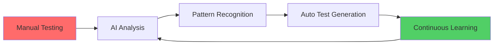

<div align="center">


[](https://git.io/typing-svg)

</div>

---

## 🎯 About Me

**게임 QA 엔지니어**

생성형 AI와 바이브 코딩을 활용하여 **AI가 학습하고 진화하는 QA 프로세스**를 설계하고 싶습니다.

```
🎮 Game Quality Assurance + 🤖 Generative AI = 🚀 Next-Gen Testing
```

### 💡 Core Competencies

```yaml
Domain Expertise:
  - Game QA Engineering & Test Automation
  - AI-Powered Quality Analysis
  - Computer Vision for Game Testing
  
Technical Skills:
  - Generative AI Tools: Claude AI, GPT-4, Cursor AI
  - Frameworks: AI SDK Integration, API Development
  - Specialization: Vibe Coding, Prompt Engineering
  
QA Focus Areas:
  - Automated Bug Detection
  - AI-Assisted Test Case Generation
  - Visual Regression Testing
  - Game Balance Analysis
```

---

## 🚀 Featured Projects

### 🎯 [Universal Game QA Tool](https://github.com/haneulk1004/universal-game-qa-tool)
**범용 게임 QA 리서치 플랫폼**
- **Tech**: JavaScript, AI API Integration
- **Impact**: 모든 게임 장르(야구/FPS/MMORPG/모바일) 지원하는 확장 가능 아키텍처
- **AI Role**: 자동 버그 분류 및 우선순위 추론 시스템

### 💰 [PriceCheck](https://github.com/haneulk1004/pricecheck)
**컴퓨터 비전 기반 제품 시세 추론 서비스**
- **Tech**: HTML, Vision AI, Image Recognition
- **Innovation**: 사진 한 장으로 제품 식별 및 시장 가격 추정
- **Application**: E-commerce QA 자동화에 응용 가능

### 🔐 [JIN-Encoder](https://github.com/haneulk1004/JIN-Encoder)
**Python 기반 데이터 인코딩 도구**
- **Tech**: Python
- **Use Case**: 테스트 데이터 관리 및 보안 처리

---

## 🛠️ Tech Stack

<div align="center">

### AI & Automation


### Tools & Platforms


</div>

---

## 🎓 Professional Philosophy

> **"AI는 QA를 대체하지 않습니다. AI를 활용하는 QA가 그렇지 못한 QA를 대체합니다."**

### My Approach to AI-Powered QA



1. **바이브 코딩 마인드**: 완벽한 코드보다 빠른 프로토타입과 반복 개선
2. **AI 협업**: 생성형 AI를 페어 프로그래머로 활용
3. **데이터 기반 의사결정**: 직감이 아닌 메트릭스로 품질 판단
4. **자동화 우선주의**: 반복 가능한 작업은 무조건 자동화

---

## 🏆 Why Hire Me?

| 기존 QA 엔지니어 | **haneulk (AI-Powered QA)** |
|:---:|:---:|
| 테스트 케이스 작성 | AI가 시나리오 생성, 엔지니어는 검증 |
| 주관적 품질 판단 | 데이터 기반 객관적 분석 |
| 고정된 테스트 범위 | AI가 예상치 못한 엣지 케이스 탐색 |

---

## 📫 Let's Connect

<div align="center">

[](https://github.com/haneulk1004)
[](mailto:sonicsilver@naver.com)
[](https://github.com/haneulk1004)


**즐거운 바이브 코딩!!** 🚀

</div>


